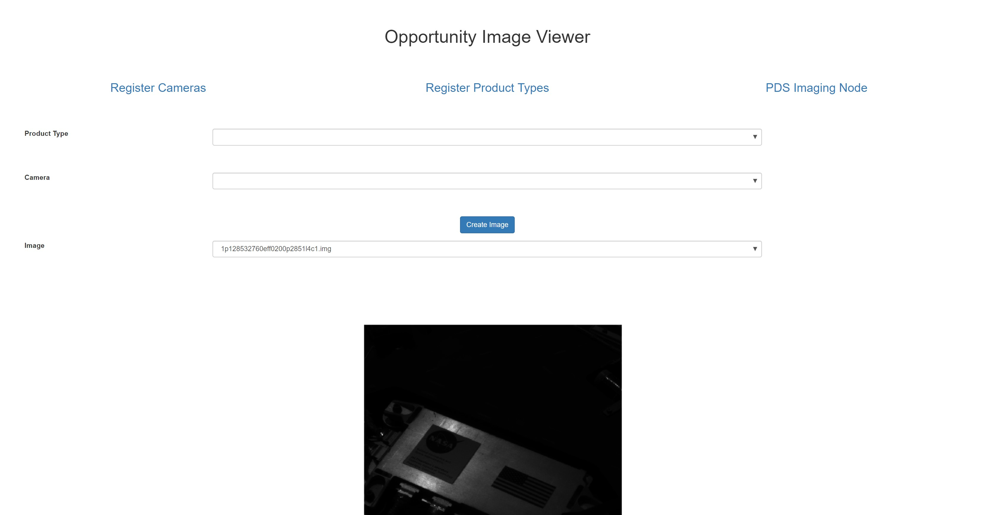

Opportunity App
===============

.. image:: https://travis-ci.com/pbvarga1/opportunity.svg?branch=master
  :target: https://travis-ci.com/pbvarga1/opportunity
.. image:: https://coveralls.io/repos/github/pbvarga1/opportunity/badge.svg?branch=master
  :target: https://coveralls.io/github/pbvarga1/opportunity?branch=master
.. image:: https://img.shields.io/github/license/pbvarga1/opportunity.svg?style=plastic
  :target: https://github.com/pbvarga1/opportunity/blob/master/LICENSE
.. image:: https://img.shields.io/badge/python-3.7-blue.svg
  :target: https://www.python.org/downloads/release/python-371/
.. image:: https://img.shields.io/badge/AngularJS-1.6.9-red.svg
  :target: https://docs.angularjs.org/guide
.. image:: https://zenodo.org/badge/172360719.svg
   :target: https://zenodo.org/badge/latestdoi/172360719

.. contents:: Table of Contents
  :local:

I want to play around with some programming techniques (listed below). This
repo can be used as examples of using these techniques (although I do not
guarantee that they are all the *best* way to do things as I am just learning).
To explore these techniques, I'm creating a simple app and adding just enough
complexity to serve as real world examples without it becoming too large. The
application is a local website where one can look at images taken by the
opportunity rover. As a note, the front-end is not my main concern, most of the
skills I want to practice regard the back-end. To maintain my work, I separate
different uses of packages into different branches. For example, I have a
branch for a Flask front-end and a branch for a Quart front-end (see
Branches_). See the issues for what I plan to do going forward.

Branches
--------

.. _Master: https://github.com/pbvarga1/opportunity#opportunity-app
.. _Flask-Frontend: https://github.com/pbvarga1/opportunity/tree/flask-frontend#opportunity-app

+-------------------+------------------------------------------------+
| Name              | Description                                    |
+===================+================================================+
| Master_           | Flask-Sqlalchemy back-end with Quart front-end |
+-------------------+------------------------------------------------+
| `Flask-Frontend`_ | Flask-sqlalchemy back-end with Flask front-end |
+-------------------+------------------------------------------------+

Software
--------

Software/techniques/packages used so far. Different branches will have different features and are broken up by branch name.

Union
+++++

* `Docker <https://docs.docker.com/>`_

  * Testing with Docker: Creating a temporary database in docker and using
  the database to test as if on a live server; Creating a redis server and
  testing against that.
  * `Multistage build <https://docs.docker.com/develop/develop-images/multistage-build/>`_

* `PostgreSQL <https://www.postgresql.org/docs/>`_

* `Flask-SQLAlchemy <http://flask-sqlalchemy.pocoo.org/2.3/>`_
* `REST API <https://en.wikipedia.org/wiki/Representational_state_transfer>`_
* `Angularjs <https://docs.angularjs.org/api>`_

  * `angular-ui bootstrap modals <https://angular-ui.github.io/bootstrap/#!#modal>`_
  * `components <https://docs.angularjs.org/guide/component>`_
  * `routing <https://docs.angularjs.org/tutorial/step_09>`_
  * `services <https://docs.angularjs.org/api/ng/type/angular.Module#service>`_

* `pytest <https://docs.pytest.org/en/latest/contents.html>`_

  * `fixtures <https://docs.pytest.org/en/latest/fixture.html>`_

* `mock <https://docs.python.org/3/library/unittest.mock.html>`_
* `Travis-CI <https://docs.travis-ci.com/>`_
* `coveralls (code coverage) <https://docs.coveralls.io/>`_
* `flake8 (pep8 style guide) <http://flake8.pycqa.org/en/latest/>`_
* `python packaging <https://packaging.python.org/tutorials/packaging-projects/#creating-setup-py>`_
* `yarn <https://yarnpkg.com/en/>`_

  * js package management in general

* `redis <https://redis.io/>`_

  * `redis-py <https://redis-py.readthedocs.io/en/latest/>`_
  * `redis hashes <https://redis.io/topics/data-types#hashes>`_

* `Type Hints <https://www.python.org/dev/peps/pep-0484/>`_

  * `Python typing <https://docs.python.org/3.6/library/typing.html>`_
  * `Static Type Checking with Mypy <https://www.python.org/dev/peps/pep-0484/>`_
  * `Stub Files <https://www.python.org/dev/peps/pep-0484/#stub-files>`_

    * See also `Mypy Stubs <https://mypy.readthedocs.io/en/latest/stubs.html>`_

* `Swagger <https://swagger.io/>`_

  * `OpenAPI 3.0 <https://swagger.io/docs/specification/about/>`_
  * `OpenAPI 2.0 <https://swagger.io/docs/specification/2-0/basic-structure/>`_

    * `See this commit <https://github.com/pbvarga1/opportunity/blob/
      d4f523093d41a288096a04656560397e9d6ac690/app/swagger.json>`_

* `Sphinx Documentation <http://www.sphinx-doc.org/en/master/>`_

  * `Restructured Text (rst) format <http://www.sphinx-doc.org/en/master/usage/restructuredtext/basics.html>`_
  * `Autodoc extension <http://www.sphinx-doc.org/en/master/usage/xtensions/autodoc.html>`_
  * `NumpyDoc extension <https://numpydoc.readthedocs.io/en/latest/install.html#sphinx-config-options>`_

* `Numpy Docstrings <https://numpydoc.readthedocs.io/en/latest/format.html>`_

Master
++++++

* `Async/Await <https://www.python.org/dev/peps/pep-0492/#specification>`_
* `Asyncio <https://docs.python.org/3/library/asyncio.html>`_
* `Quart <http://pgjones.gitlab.io/quart/>`_

  * Use with Angular
  * `Blueprints <http://pgjones.gitlab.io/quart/blueprints.html>`_

* `AIOHTTP <https://aiohttp.readthedocs.io/en/stable/>`_
* `aioredis <https://aioredis.readthedocs.io/en/v1.2.0/>`_
* `pytest-asyncio <https://github.com/pytest-dev/pytest-asyncio>`_
* `pytest-aiohttp <https://docs.aiohttp.org/en/stable/testing.html>`_
* `pytest-mock <https://github.com/pytest-dev/pytest-mock/>`_
* `logging <https://docs.python.org/3/library/logging.html>`_
* `Sentry <https://sentry.io/welcome/>`_

  * `Sentry On-Premise: Docker <https://github.com/getsentry/onpremise>`_
  * `Python sentry_sdk <https://docs.sentry.io/error-reporting/quickstart/?platform=python>`_
  * `AngularJS sentry_sdk <https://docs.sentry.io/error-reporting/quickstart/?platform=node#pick-a-client-integration>`_

Flask-Frontend
++++++++++++++

* Flask + Angular

  * Routing to multiple pages handled by Angular through Flask

* `Flask <http://flask.pocoo.org/>`_

  * `Blueprints <http://flask.pocoo.org/docs/1.0/blueprints/>`_

Quick Start
-----------

If you want to use this project for your own learning exercises, fork the repo
to your own github account and then clone your forked repo to your computer.
Make sure docker is installed and running. To get the application running:

1. If you are **not** using docker
   toolbox, set the following environment envariable:

   .. code-block:: bash

    $ export DOCKER_IP='127.0.0.1'

2. You will need to adjust the volumes in ``docker-compose.yml`` to your own
   paths.

3. If using a volume for the `opp-web`` service (as I do), you have to install
   the node packages first. ``cd`` into the directory with the ``package.json``
   file and then

   .. code-block:: bash

     $ yarn install --modules-folder static/node_modules

3. To get sentry working, follow the instructions from
   `Sentry on Premise <https://github.com/getsentry/onpremise>`_ reproduced
   below:

   1. ``docker volume create --name=sentry-data && docker volume create --name=opportunity-postgres``

   2. Make adjustments to the ``.env`` file.

   3. ``docker-compose build`` - Build and tag the Docker services

   4. ``docker-compose run --rm web config generate-secret-key`` - Generate a
      secret key. Add it to ``.env`` as ``SENTRY_SECRET_KEY``.

   5. ``docker-compose run --rm web upgrade`` - Build the database. Use the
      interactive prompts to create a user account.

      * If you never get to the interactive prompt, you need to make room
        by deleting images and volumes.

4. From the top directory ``oportunity``, run:

.. code-block:: bash

   $ docker-compose up

Which will build the images and run the docker containers. If you are using
dockertoolbox, then the host will be ``192.168.99.100``, otherwise it will be
the local host ``127.0.0.1``. In the examples ahead, I assume the host will
be ``127.0.0.1``. In your browser go to ``http://127.0.0.1:5002/`` to
see the home web page:

The first two links allow you to register product types (i.e. EDR, RDR) and
cameras (i.e. pancam). The third link is where you will find images to
register. Clicking ``Register Image`` allows you to register an image with the
local database and then select it for viewing. Selecting an image will display
it on the home page.

Port ``5001`` is where the API is located to retrieve data from the database.

Links
-----

+----------------+-----------------------------+------------------------+
|   Page         |      Toolbox                |     Docker             |
+================+=============================+========================+
|   **Home**     | http://192.168.99.100:5002/ | http://127.0.0.1:5002/ |
+----------------+-----------------------------+------------------------+
|   **Docs**     | http://192.168.99.100:5005/ | http://127.0.0.1:5005/ |
+----------------+-----------------------------+------------------------+
|   **Swagger**  | http://192.168.99.100:5004/ | http://127.0.0.1:5004/ |
+----------------+-----------------------------+------------------------+
|   **Sentry**   | http://192.168.99.100:9000/ | http://127.0.0.1:9000/ |
+----------------+-----------------------------+------------------------+

Citing this Repo
----------------

It's MIT Licensed so feel free to use whatever you want from here. I don't care
if you do not cite this repo in published work if you used any of it. Creating
the DOI was more of an exercise for myself than anything else.
